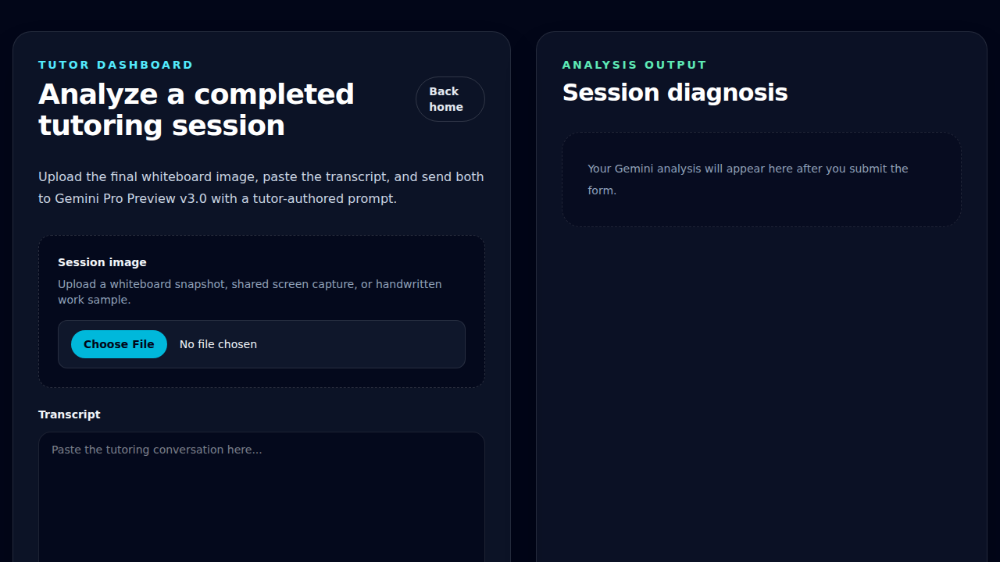
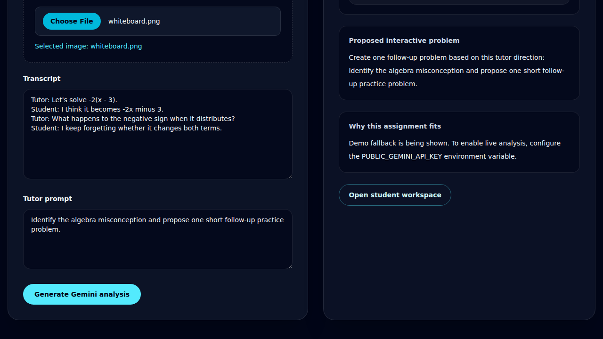
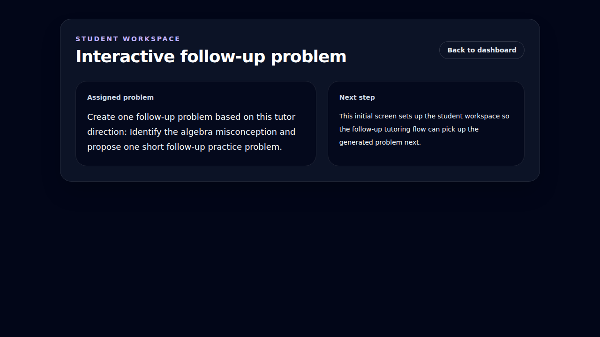

# Tutor Dashboard Analysis Flow

Validates the tutor dashboard submission flow and the student workspace handoff.

## Tutor dashboard form

### Verifications

- [x] Tutor dashboard heading is visible
- [x] Generate button is enabled after hydration

## Generated analysis results

### Verifications

- [x] Knowledge gaps section is visible
- [x] Fallback badge is visible for test mode
- [x] Analysis contains the negative sign insight
- [x] Student workspace button is available

## Student workspace handoff

### Verifications

- [x] Student workspace heading is visible
- [x] Assigned problem card is populated
