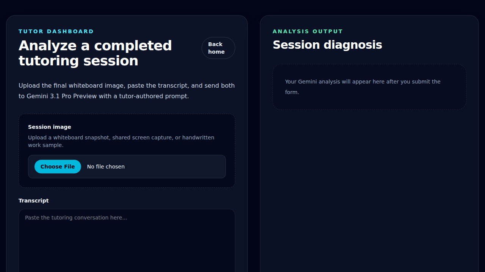
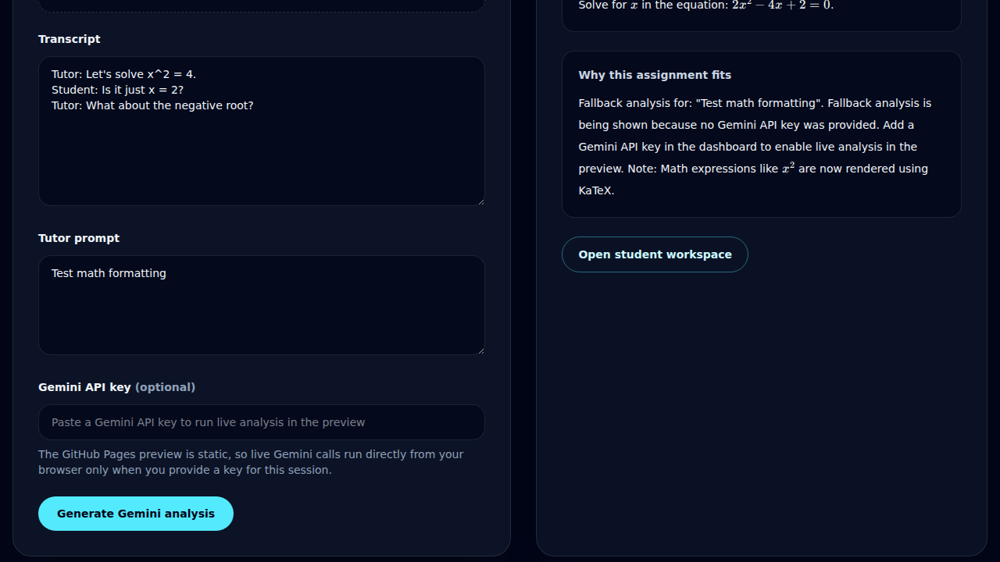
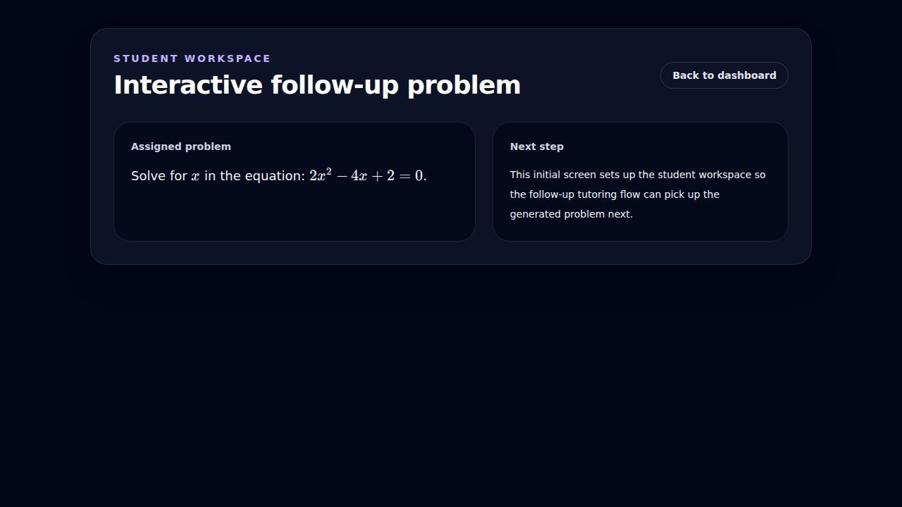

# Math Formatting Verification

Validates that mathematical expressions are rendered using KaTeX.

## Tutor dashboard form

### Verifications

- [x] Tutor dashboard heading is visible
- [x] Generate button is enabled after hydration

## Math rendering in tutor dashboard

### Verifications

- [x] KaTeX elements are present in knowledge gaps
- [x] Specific math expression x^2 is rendered

## Math rendering in student workspace

### Verifications

- [x] Student workspace heading is visible
- [x] KaTeX elements are present in student workspace
